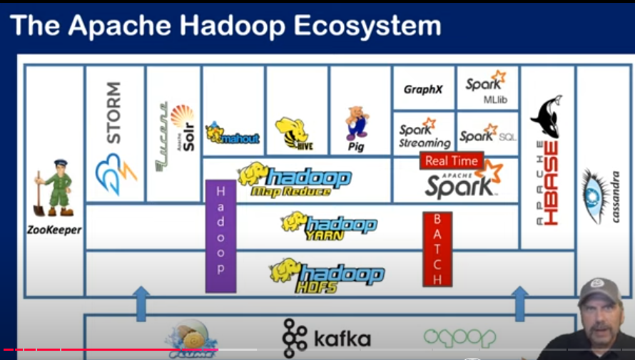
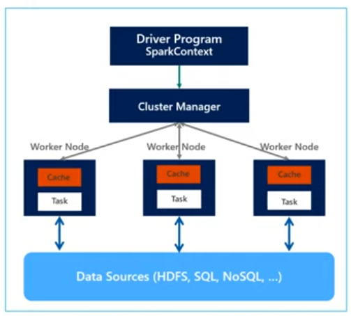
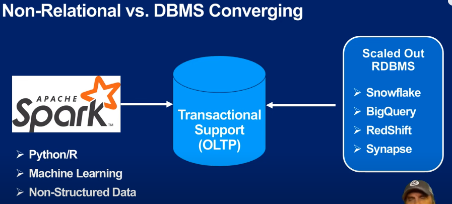

# Master Databricks and Apache Spark

Ressources: https://github.com/bcafferky/shared/tree/master/MasterDatabricksAndSpark

## Table of Contents
1. [Introduction](#lesson-1-introduction)

## Lesson 1: Introduction
- Combining the big 3 : AI, Big Data, and Cloud Computing
- What is Apache Spark? Open source big data platform for Data Science and Engineering
- Raw, not ide, not notebook, not a database, no collaboration, no version control
- Not optimized for cloud
- Databricks: Commercial version of Apache Spark, complementary services, optimized for cloud, ideal for data science team collaboration, version control, and more

### What is special about Databricks?
Scale up reached a cap ... Databricks can scale out ! What is scale out? It is the ability to add more resources to a system to increase its capacity. Databricks can scale out to handle more data and more users. Same as vertical scaling, vs horizontal scaling. *horizontal scaling is like scaling out, adding more nodes to a cluster.*

### First came Hadoop
Was first open-source big data platform, but it was slow and complex. Spark was created to be faster and easier to use. Spark is 100x faster than Hadoop.

### The Apache Haddop Ecosystem

- HDFS: Hadoop Distributed File System, partioning data across multiple nodes
- Zookeeper: Distributed coordination service, meaning it helps manage a cluster of machines
- YARN: Yet Another Resource Negotiator, manages resources in a Hadoop cluster
- Spark: In-memory *real-time* data processing engine, faster than Hadoop
- Kafka: Distributed streaming platform, used for building real-time data pipelines and streaming apps

### Spark Components

Spark is a replacement of MapReduce because everybody that work with data knows that reading and writing in disk gonna slow everything down, so Spark is in-memory, meaning it reads and writes data in memory, which is faster than reading and writing to disk.

Spark has 4 main components:
- Spark SQL: SQL interface for Spark, allows you to run SQL queries on Spark data (80% of data science work)
- Spark Streaming: Real-time data processing, like Kafka
- MLlib: Machine learning library, built on top of Spark
- GraphX: Graph processing library, built on top of Spark

### General Spark Cluster Architecture

- Driver runs the user main function
- Data sources(HDFS, SQL, NoSQl. DataLake) all fancy names that emulates HDFS behavior but with more or less features or efficient way to be faster.
- Spark is not for storage, it is for processing. It is not a database, it is a processing engine.
- Spark core: The core of Spark, the engine that runs the code 
- Spark SQL: *SQL interface for Spark, even if it's not stored in a SQL database, you can still run SQL queries on it*

### Azure Databricks
Has notebooks like Jupyter, but with more features. It is a collaborative environment for data science and engineering teams. It is optimized for cloud, and it has a job scheduler, a cluster manager, and a workspace for collaboration. It is integrated with Azure, so you can use Azure services like Azure Data Lake, Azure Blob Storage, and Azure SQL Data Warehouse. It is also integrated with Azure Active Directory, so you can use your Azure AD credentials to log in.

### Lesson 2: Create a Databricks Workspace
- Runtime is special version of Spark, optimized for Databricks

%fs commande for databricks file system
also %sh for shell commands
%sql SHOW TABLES oR DESCRIBE TABLE tablename

### Lesson 3: Demo - Introduction to Databricks

### Lesson 4: Create a Spark Cluster from the Azure Portal
- HDinsight is a managed Hadoop service in Azure to run Spark, Hadoop, and other big data frameworks
- PASS: Platform as a Service, like Azure Databricks for Spark
- Then use Zeppelin or Jupyter notebooks to run Spark code

### Lesson 5: Using the Data Science Process 
- Framework the structure of your work
-- Business understanding: identify the problem, define the goal and the data required
-- Data Collection
-- Data Exploration: understand the data, clean the data, visualize the data
-- Feature Engineering: create new features from the data
-- Modeling: build a model to predict the target variable
-- Evaluation: evaluate the model, tune the model
-- Deployment: deploy the model to production

#### Business Understanding/ Analysis
- Document the problem, the goal, and the data required
- Cost Constraints: how much money can you spend on the project?
- Assumptions: what assumptions are you making about the data?
- Identify Data Sources: where is the data coming from?

#### Data Engineering
- Pull data from data sources
- Clean the data
- EDA: Exploratory Data Analysis, visualize the data, understand the data
- Find pareto principle: 80% of the results come from 20% of the causes
- Evaluate and identify problems with the data
- Feature Engineering: transform the data into model features

#### Modeling
- Split the data into training and testing sets
- Data resampling: oversample the minority class, undersample the majority class
- Select the best model: use cross-validation to select the best model
- Model deployment: deploy the model to production
- Post Deployment: monitor the model, retrain the model, visualize 

### Lesson 6: Understanding Spark SQL

What is Spark SQL?
- Distributed dataframe at scale
Even if you are doing R or Python, you are still using Spark SQL under the hood which is being optimized by Spark SQL engine.

Schema on read: advantagous because you dont have to replicate, ingest or anything, just query it
Data is not in an RDBMS, it is in a file, so you have to define the schema when you read the data
External File is Described Structurally
Does NOT have a database catalog and NO stored procedures or functions
Does not support referential integrity ! i.e. no foreign keys
Limited security features, no user roles, no row-level security

#### Delta Lake
 Delta lake is Databricks responses to Redshift, DataFactory and Snowflake datawarehouses.
 - Delta lake delivers more RDBMS like functionality, but with the scale and flexibility
- Use parquet which is very fast and efficient, and it is columnar storage, so it is faster than row storage 
RDBMS running on clusters, with ACID transactions, schema enforcement, and data versioning
- ACID: Atomicity (all or nothing), Consistency (data is consistent), Isolation (transactions are isolated), Durability (data is durable)

Spark is trying to bring OLTP.
- OLTP: Online Transaction Processing, like a bank transaction

Delta lake is moving towards a datawarehouse.

### Lesson 7: Using Spark SQL  Data Definition Language (DDL)

What are SQL DDL ?
- Create, Alter, Drop, Truncate, Rename, Comment, Describe Database Objects
- Create, Drop or change Partitions (so you can contorl how your data is save)

- SHOW FUNCTIONS 
- SHOW CREATE TABLE ( give you the schema of the table that  you can copy and paste and chnange !)
- USE mydatabase (to switch to a database / the context)
- Database are like folders/namespace, they are not like databases in SQL
- Properties are spark specific, they are not SQL standard, they allow you to set value pairs
- You want to save you data in a partionned way, so you can query it faster like for example zipcode, date, etc

### Lesson 9: Creating a Database and Tables in Spark SQL: Databricks
The AdventureWorks Project Use Case : get business insights from the data
Then create a ML model to predict the sales of a product
Star schema is the best schema for data warehousing, the idea is that your fact table only holds metrics
Metrics are actually the measures that you want to analyze, like sales, revenue, etc
The dimension tables are the tables that hold the attributes of the metrics, like the product, the customer, the date, etc
dimensions don't join to each other, they only join to the fact table, if they do join to each other, then they are not dimensions, they are fact tables or it's a snowflake schema
- Redundancy is good in data warehousing, because it makes the queries faster

### Lesson 10: Creating a Database and Tables in Spark SQL: Raw Spark
- Permanent storage VS Temporary storage on the cluster: You have to make sure that 
you enable container storage on the cluster, so that the data is not lost when the cluster is terminated !

